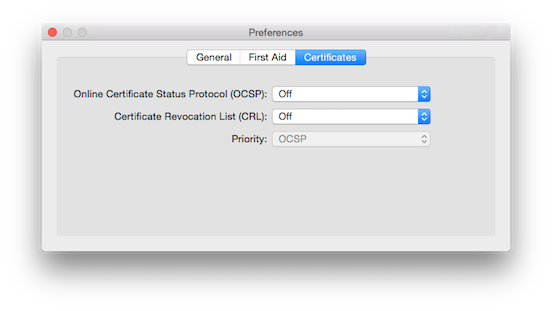

# Apple-P12

# Convert Apple Certificate into a P12 file

## Step 1: Create a “.certSigningRequest” (CSR) file
* Open Keychain Access on your Mac (found in Applications/Utilities)
* In the main Keychain Access window ( <b>make sure that you don’t have a private key already selected</b> ) 
<br>otherwise this process will not work correctly
<br>From the toolbar, open Keychain Access > Preferences
* In the pop up window that appears, click the Certificates tab

* Set both <b>“Online Certificate Status Protocol”</b> and <b>“Certificate Revocation List”</b> to <b>“Off”<b>
<br>( <b>see screenshot above</b> )
* Close this window
* Back in the toolbar, open Keychain Access > Certificate Assistant > Request a Certificate From a Certificate Authority

## Step 2

```bash
# Setup one create 
