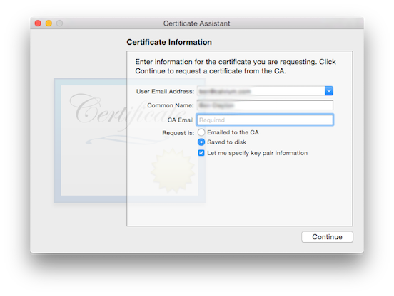

# Apple-P12

# Convert Apple Certificate into a P12 file

## Step 1: Create a “.certSigningRequest” (CSR) file
* Open Keychain Access on your Mac (found in Applications/Utilities)
* In the main Keychain Access window ( <b>make sure that you don’t have a private key already selected</b> ) 
<br>otherwise this process will not work correctly
<br>From the toolbar, open Keychain Access > Preferences
* In the pop up window that appears, click the Certificates tab

* Set both: 
<br>&nbsp;&nbsp;&nbsp;&nbsp;<b>“Online Certificate Status Protocol” = “Off”</b>
<br>&nbsp;&nbsp;&nbsp;&nbsp;<b>“Certificate Revocation List” = “Off”</b>
<br>&nbsp;&nbsp;&nbsp;&nbsp;( <b>see screenshot above</b> )
<br>
<br>
<b>*** Close this window ***</b>

* In the Keychain Access toolbar
<br>&nbsp;&nbsp;&nbsp;&nbsp;Open Keychain Access > Certificate Assistant > Request a Certificate From a Certificate Authority

* Enter:
<br>&nbsp;&nbsp;&nbsp;&nbsp;<b>“User Email Address”</b>
<br>&nbsp;&nbsp;&nbsp;&nbsp;<b>“Common Name” ( name of the developer as it appears in your Apple Developer Account )</b>
<br>&nbsp;&nbsp;&nbsp;&nbsp;<b>“CA Email”</b> ( <b>Leave blank</b> )
<br>&nbsp;&nbsp;&nbsp;&nbsp;<b>“Saved to disk”</b> ( <b>selected</b> )
<br>&nbsp;&nbsp;&nbsp;&nbsp;<b>“Let me specify key pair information” ( <b>checked</b> )

Click Continue
Choose a filename & destination on your hard drive
(e.g. “companyName.certSigningRequest”)
Click Save
In the next window, for “Key Size” choose “2048 bits”

## Step 2

```bash
# Setup one create 
