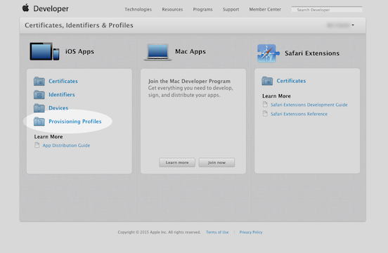
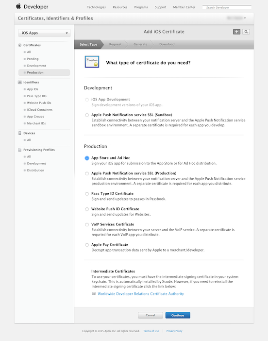

# Convert Apple Certificate into a P12 file

## STEP 1: Create a “.certSigningRequest” (CSR) file
* Open Keychain Access on your Mac (found in Applications/Utilities)
* In the main Keychain Access window ( <b>make sure that you don’t have a private key already selected</b> ) 
 otherwise this process will not work correctly
 From the toolbar, open Keychain Access > Preferences
* In the pop up window that appears, click the Certificates tab
* 

* Set both: 
 &nbsp;&nbsp;&nbsp;&nbsp;<b>“Online Certificate Status Protocol” = “Off”</b>
 &nbsp;&nbsp;&nbsp;&nbsp;<b>“Certificate Revocation List” = “Off”</b>
 &nbsp;&nbsp;&nbsp;&nbsp;( <b>see screenshot above</b> )
 
 
<b>*** Close this window ***</b>

* In the Keychain Access toolbar
 &nbsp;&nbsp;&nbsp;&nbsp;Open Keychain Access > Certificate Assistant > Request a Certificate From a Certificate Authority

* Enter:
 &nbsp;&nbsp;&nbsp;&nbsp;<b>“User Email Address”</b>
 &nbsp;&nbsp;&nbsp;&nbsp;<b>“Common Name” ( name of the developer as it appears in your Apple Developer Account )</b>
 &nbsp;&nbsp;&nbsp;&nbsp;<b>“CA Email” ( Leave blank )</b>
 &nbsp;&nbsp;&nbsp;&nbsp;<b>“Saved to disk” ( selected )</b>
 &nbsp;&nbsp;&nbsp;&nbsp;<b>“Let me specify key pair information” ( checked )</b>
 
 &nbsp;&nbsp;&nbsp;&nbsp;Click Continue
 
 Choose a filename & destination on your hard drive ( e.g. “CommanName.certSigningRequest” ) 
 
 &nbsp;&nbsp;&nbsp;&nbsp;Click Save
 
 
* In the next window

 &nbsp;&nbsp;&nbsp;&nbsp;<b>“Key Size” = “2048 bits”</b>
 &nbsp;&nbsp;&nbsp;&nbsp;<b>“Algorithm” choose “RSA”</b>
 
 &nbsp;&nbsp;&nbsp;&nbsp;Click Continue

This will create and save your certSigningRequest file (CSR) to your hard drive. 
A public and private key will also be created in Keychain Access with the Common Name you entered earlier (e.g. John Smith)

## STEP 2: Create the “.cer” file in your iOS Developer Account
* Log on to https://developer.apple.com

* Click <b>“Certificates, Identifiers & Profiles”</b>

* Click <b>“Provisioning Profiles”</b> from the left-hand column

* In the <b>“Certificates”</b> section at the top of the left-hand panel
* Click <b>“Production”</b>
* Click the <b>“Add” (+)</b> button at the top-right of the main panel

In the main panel ( Select <b>“Development”</b> or <b>“Production”</b> Option needed )

* Click Continue

* Click <b>“Choose File”</b> & find the CSR file you’ve just made from your hard drive

* Click <b>“Generate”</b> and wait for the file to process 

* Click <b>“Download”</b> to get the file, and then click the Done button at the bottom once the download has finished

## STEP 3: Install the .cer and generate the .p12
